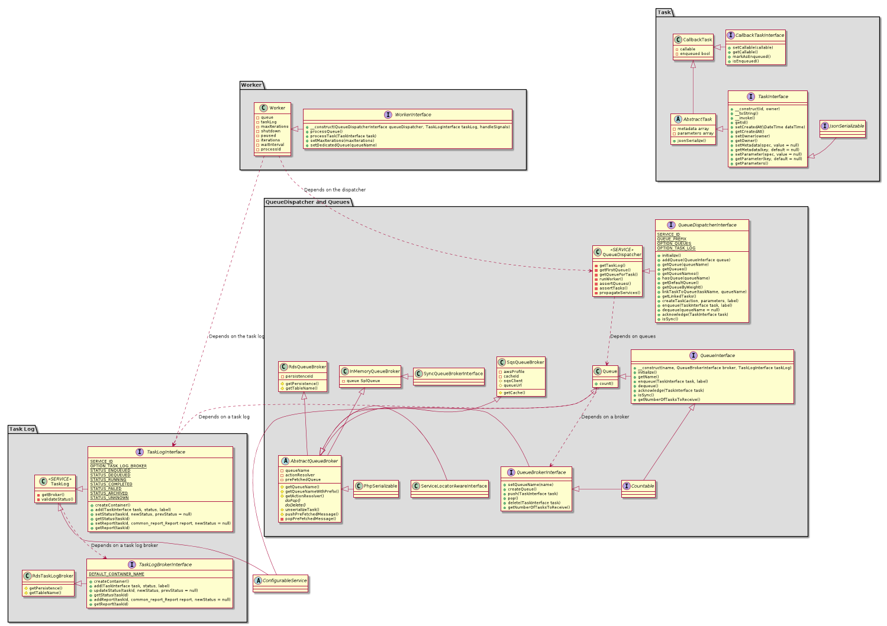

# Distributed Task Queue

> This article describes the functioning of the new distributed Task Queue.

## Install

You can add the Task Queue as a standard TAO extension to your current TAO instance.

```bash
 $ composer require oat-sa/extension-tao-task-queue
```

## Components

The task queue system is built on the following components.

### Queue Dispatcher component

The Dispatcher can hold multiple Queue instances to achieve the priority mechanism. Each Queue is associated to a certain priority level.
There is an option for setting the default Queue. If it is not set, the first queue will be used as default.

This is the _**main service**_ to be used for interacting with the queue system.

Tasks can be linked to a specific Queue, meaning they will always be published into that Queue. This can be achieved by two ways:
- adding the task full name and the queue to OPTION_TASK_TO_QUEUE_ASSOCIATIONS
- using \oat\taoTaskQueue\model\QueueNameGetterInterface in your Action. You will have the freedom inside of your action in runtime 
to decide which queue you want your task to be published to. The parameters used by your action are passed to that method.

_Note_: 
>The second option overwrites the first one. If none of those ways is used than the task will be published into the default Queue.

There can be set only one Queue as well. In that case every task will be published into that one.

### Queue component

Queue can work with different types of queue brokers. There are three type of message brokers for the time being:
- **InMemoryQueueBroker** which accomplishes the Sync Queue mechanism. Tasks will be executing straightaway after adding them into the queue.
- **RdsQueueBroker** which stores tasks in RDS.
- **SqsQueueBroker** which is for using AWS SQS.

_Note_: 
> When SqsQueueBroker is used, please make sure that "**oat-sa/lib-generis-aws**" is included in the main composer.json and you have 
> generis/awsClient.conf.php properly configured.

#### Weight
A Queue can have a weight. If multiple Queues are in use, this weight will be used for randomly select a Queue to be consumed. 
For example, if QueueA has weight of 1 and QueueB has weight of 2, then QueueB has about a 66% chance of being selected.

### Worker component

Its duty is to get a **Task** from the specified queue and execute it. **Multiple workers can be run at the same time.**
It has built-in signal handling for the following actions:
 - Shutting down the worker gracefully: SIGTERM/SIGINT/SIGQUIT
 - Pausing task processing: SIGUSR2
 - Resuming task processing: SIGCONT
 
After processing the given task, the worker saves the generated report for the task through the Task Log.

### Task Log component
It's responsible for managing the lifecycle of Tasks. Can be accessed as a service. 
It stores the statuses, the generated report and some other useful metadata of the tasks.
To access those data, you can use the `search` function which takes a `TaskLogFilter` as an argument
or `getDataTablePayload` method if you want to handle the standard datatable request.

Its main duty is preventing of running the same task by multiple workers at the same time. 

It can also have multiple brokers extending TaskLogBrokerInterface to store the data in different type of storage system. 
Currently we have **RdsTaskLogBroker** which uses RDS.


## Service setup examples

### Sync Queue settings

Basic solution with only one Queue which uses InMemoryQueueBroker.

```php
use oat\taoTaskQueue\model\QueueDispatcher;
use oat\taoTaskQueue\model\QueueDispatcherInterface;
use oat\taoTaskQueue\model\Queue;
use oat\taoTaskQueue\model\TaskLogInterface;
use oat\taoTaskQueue\model\QueueBroker\InMemoryQueueBroker;

$queueService = new QueueDispatcher(array(
    QueueDispatcherInterface::OPTION_QUEUES => [
        new Queue('queue', new InMemoryQueueBroker()),
    ],
    QueueDispatcherInterface::OPTION_TASK_LOG     => TaskLogInterface::SERVICE_ID,
    QueueDispatcherInterface::OPTION_TASK_TO_QUEUE_ASSOCIATIONS => []
));

$this->getServiceManager()->register(QueueDispatcherInterface::SERVICE_ID, $queueService);
```

### Multiple Queues settings

In this case we have 3 Queues registered: one of them is using SQS broker, the other two RDS. 
Every Queue has its own weight (like 90, 30, 10) which will be used at selecting the next queue to be consumed.

And we have two tasks linked to different queues, furthermore the default queue is specified ('background')
what will be used for every other tasks not defined in OPTION_TASK_TO_QUEUE_ASSOCIATIONS.

```php
use oat\taoTaskQueue\model\QueueDispatcher;
use oat\taoTaskQueue\model\Queue;
use oat\taoTaskQueue\model\QueueBroker\RdsQueueBroker;
use oat\taoTaskQueue\model\QueueBroker\SqsQueueBroker;
use oat\taoTaskQueue\model\TaskLogInterface;
use oat\taoTaskQueue\model\QueueDispatcherInterface;

$queueService = new QueueDispatcher(array(
    QueueDispatcherInterface::OPTION_QUEUES => [
        new Queue('priority', new SqsQueueBroker('default', \common_cache_Cache::SERVICE_ID, 10), 90),
        new Queue('standard', new RdsQueueBroker('default', 5), 30),
        new Queue('background', new RdsQueueBroker('default', 5), 10)
    ],
    QueueDispatcherInterface::OPTION_TASK_LOG     => TaskLogInterface::SERVICE_ID,
    QueueDispatcherInterface::OPTION_TASK_TO_QUEUE_ASSOCIATIONS => [
        SomeImportantAction::class => 'priority',
        SomeLessImportantTask::class => 'standard'
    ]
));

$queueService->setOption(QueueDispatcherInterface::OPTION_DEFAULT_QUEUE, 'background');

$this->getServiceManager()->register(QueueDispatcherInterface::SERVICE_ID, $queueService);
```

If the queue has not been initialized, meaning the required queue container has not been created yet:
```php
try {
    $queueService->initialize();
} catch (\Exception $e) {
    return \common_report_Report::createFailure('Initializing queues failed');
}
```

### Task Log settings
```php
use oat\taoTaskQueue\model\TaskLog;
use oat\taoTaskQueue\model\TaskLogInterface;
use oat\taoTaskQueue\model\TaskLogBroker\RdsTaskLogBroker;

$taskLogService = new TaskLog([
    TaskLogInterface::OPTION_TASK_LOG_BROKER => new RdsTaskLogBroker('default', 'task_log')
]);
$this->getServiceManager()->register(TaskLogInterface::SERVICE_ID, $taskLogService);
```

If the task log container has not been created yet:
```php
try {
    $taskLogService->createContainer();
} catch (\Exception $e) {
    return \common_report_Report::createFailure('Creating task log container failed');
}
```

### Initializing the queues and the task log container

You can run this script if you want to be sure that the required queues and the task log container are created.

```bash
 $ sudo -u www-data php index.php 'oat\taoTaskQueue\scripts\tools\InitializeQueue'
```

_Note_:
> This script also can be used to change the current queues to use a different queue broker.

- Changing every existing queue to use InMemoryQueueBroker. (Sync Queue)
```bash
 $ sudo -u www-data php index.php 'oat\taoTaskQueue\scripts\tools\InitializeQueue' --broker=memory
```

- Changing every existing queue to use RdsQueueBroker. 
Option "persistence" is required, "receive" (Maximum amount of tasks that can be received when polling the queue) is optional.
```bash
 $ sudo -u www-data php index.php 'oat\taoTaskQueue\scripts\tools\InitializeQueue' --broker=rds --persistence=default --receive=10
```

- Changing every existing queue to use SqsQueueBroker. Option "aws-profile" is required, "receive" is optional.
```bash
 $ sudo -u www-data php index.php 'oat\taoTaskQueue\scripts\tools\InitializeQueue' --broker=sqs --aws-profile=default --receive=10
```

### Running a worker

To run a worker, use the following command. It will start a worker for running infinitely and iterating over every registered Queues based in their weights.

```bash
 $ sudo -u www-data php index.php 'oat\taoTaskQueue\scripts\tools\RunWorker'
```

If you want the worker running for a dedicated Queue, pass the name of the queue to the command like this:

```bash
 $ sudo -u www-data php index.php 'oat\taoTaskQueue\scripts\tools\RunWorker' --queue=priority
```

You can limit the iteration of the worker. It can be used only on a dedicated queue.

```bash
 $ sudo -u www-data php index.php 'oat\taoTaskQueue\scripts\tools\RunWorker' --queue=standard --limit=5
```

## Usage examples

- Getting the queue service as usual:

```php
$queueService = $this->getServiceManager()->get(\oat\taoTaskQueue\model\QueueDispatcherInterface::SERVICE_ID);
```

### Working with Task

There is two ways to create and publish a task.

- **First option**: creating a task class extending \oat\taoTaskQueue\model\AbstractTask. It's a new way, use it if you like it and if you don't need the possibility to run your task as an Action from CLI.
```php
<?php

use \common_report_Report as Report;
use \oat\taoTaskQueue\model\AbstractTask;

class MyFirstTask extends AbstractTask
{
    // constants for the param keys
    const PARAM_TEST_URI = 'test_uri';
    const PARAM_DELIVERY_URI = 'delivery_uri';

    /**
     * As usual, the magic happens here.
     * It needs to return a Report object. 
     */
    public function __invoke()
    {
        // you get the parameter using getParameter() with the required key
        if (!$this->getParameter(self::PARAM_TEST_URI) || !$this->getDeliveryUri()) {
            return Report::createFailure('Missing parameters');
        }

        $report = Report::createSuccess();
        $report->setMessage("I worked with Test ". $this->getParameter(self::PARAM_TEST_URI) ." and Delivery ". $this->getDeliveryUri());

        return $report;
    }

    /**
     * You can create a custom setter for your parameter.
     *
     * @param $uri
     */
    public function setDeliveryUri($uri)
    {
        // doing some validation
        // if it's a valid delivery
        $this->setParameter(self::PARAM_DELIVERY_URI, $uri);
    }

    /**
     * You can create a custom getter for your parameter.
     *
     * @return mixed
     */
    public function getDeliveryUri()
    {
        return $this->getParameter(self::PARAM_DELIVERY_URI);
    }
}
```

Then you can initiate your class and setting the required parameters and finally publish it:
```php
$myTask = new MyFirstTask();
$myTask->setParameter(MyFirstTask::PARAM_TEST_URI, 'http://taotesting.com/tao.rdf#i1496838551505670');
$myTask->setDeliveryUri('http://taotesting.com/tao.rdf#i1496838551505110');

if ($queue->enqueue($myTask, 'Label for the task')) {
    echo "Successfully published";
}
```

- **Second option**: Using Command/Action objects which implement \oat\oatbox\action\Action. This is the usual old way and more preferable because we can run those actions from CLI if needed.

```php
$task = $queue->createTask(new RegeneratePayload(), array($delivery->getUri()), 'Fancy Label');
if ($task->isEnqueued()) {
    echo "Successfully published";
}
```

As you can see, nothing has changed here. It is the same like before. The magic is behind of the createTask() method. Look into it if you dare...

Anyway, the main thing here is that a wrapper class called \oat\taoTaskQueue\model\CallbackTask is used to wrap your Action object and make it consumable for the queue system.

If you want to specify the queue the task should be published to, implement `\oat\taoTaskQueue\model\QueueAssociableInterface` in your action.

And if you want to specify the category of your task, implement `\oat\taoTaskQueue\model\Task\TaskCategoriserInterface` in your action.

#### Working with Task Log component

Mostly, it can be used when the queue is used as Sync Queue and you want to get the status and the report for a task:

```php
/** @var \oat\taoTaskQueue\model\TaskLogInterface $taskLogService */
$taskLogService = $this->getServiceManager()->get(\oat\taoTaskQueue\model\TaskLogInterface::SERVICE_ID);

// checking the status for STATUS_COMPLETED can prevent working with a null report if InMemoryQueueBroker not used anymore.
if ($task->isEnqueued() && $taskLogService->getStatus($task->getId()) == TaskLogInterface::STATUS_COMPLETED) {
    $report = $taskLogService->getReport($task->getId());
}
```

Or we can just simply check if the current queue is a sync one so we have a report surely.

```php
if ($queueService->isSync()) {
    $report = $taskLogService->getReport($task->getId());
}
```

Let's use `search` for gaining some task log entities.

```php
use \oat\taoTaskQueue\model\TaskLog\TaskLogFilter;
use \oat\taoTaskQueue\model\TaskLogBroker\TaskLogBrokerInterface;

$filter = (new TaskLogFilter())
    ->addAvailableFilters(\common_session_SessionManager::getSession()->getUserUri())
    ->eq(TaskLogBrokerInterface::COLUMN_TASK_NAME, GenerateBillingReport::class)
    ->in(TaskLogBrokerInterface::COLUMN_STATUS, [TaskLogInterface::STATUS_ENQUEUED, TaskLogInterface::STATUS_DEQUEUED, TaskLogInterface::STATUS_RUNNING]);

    
$scheduledTasks = $taskLogService->search($filter);    
```

## Rest API
The task log reports can be viewed/consume using the Application Programming Interface (API).
In order to use it please check the swagger file in (doc/taskApi.yml).

## Command Line Utility
Besides using the API to check reports of tasks, another way it's using the command line. 
```php
sudo -u www-data php index.php 'oat\taoTaskQueue\scripts\tools\TaskLogUtility' --help
```
This command will show you all the possibilities action the the utility can have.

```text
Examples
 1. Stats
	 Description: 	 Return stats about the tasks logs statuses
	 Example: 	 sudo -u www-data php index.php 'oat\taoTaskQueue\scripts\tools\TaskLogUtility' --stats
 2. List Task Logs
	 Description: 	 List All the tasks that are not archived will be retrived, default limit is 20
	 Example: 	 sudo -u www-data php index.php 'oat\taoTaskQueue\scripts\tools\TaskLogUtility' --available --limit[optional]=20 --offset[optional]=10
 3. Get Task Log
	 Description: 	 Get an specific task log by id
	 Example: 	 sudo -u www-data php index.php 'oat\taoTaskQueue\scripts\tools\TaskLogUtility' --get-task=[taskdId]
 4. Archive a Task Log
	 Description: 	 Archive a task log
	 Example: 	 sudo -u www-data php index.php 'oat\taoTaskQueue\scripts\tools\TaskLogUtility' --archive=[taskdId] --force[optional]

```

## Class Diagram

